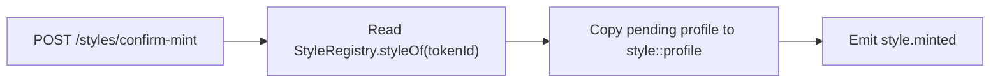
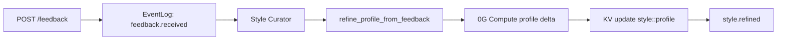
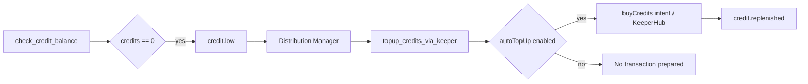

# Voices Current Build Report

Last reviewed: 2026-04-29

This document describes what is actually built in the current repository. It is written for hackathon submission preparation, demo scripting, and internal clarity. It separates implemented functionality from mockable/local-only behavior and from remaining gaps.

## 1. One-Sentence Summary

Voices is a creator-owned writing-style marketplace and agent system where creators upload private writing samples, the backend extracts a reusable style profile through a LangGraph agent swarm, stores memory through a 0G Storage-style KV/Log layer, prepares an iNFT-style mint transaction on 0G Chain, and lets consumers generate content through a coordinated multi-agent flow with credit and royalty settlement intents.

## 2. What The Project Is Trying To Prove

The core claim is not just "generate text in a style." The stronger claim is:

1. A creator's writing style can become an ownable agent asset.
2. The private source samples can be encrypted and stored off-chain through 0G Storage.
3. A structured "agent brain" or style profile can persist and evolve over time.
4. Multiple autonomous agents can coordinate through durable state and event logs.
5. Usage can be tied to on-chain credit spending and creator royalties.
6. The system can produce a verifiable trail of storage, compute, ownership, generation, feedback, and settlement events.

The backend already implements most of this workflow structurally. The remaining work is mostly around proof strength, key ownership, receipt verification, and presentation.

## 3. Repository Layout

The repository is a pnpm monorepo with three main packages:

```text
voices/
├── backend/       Fastify API, LangGraph swarm, 0G wrappers, tests, smoke scripts
├── contracts/     Solidity contracts, Hardhat config, deployment and mint scripts
├── frontend/      Next.js app and prototype/demo surfaces
├── README.md      Setup and high-level agent architecture
├── implemtation.md
└── CURRENT_BUILD_REPORT.md
```

The root package provides workspace scripts for contract compilation/testing/deploy, backend mock mode, frontend dev, storage/compute smoke tests, and agent smoke tests.

## 4. Backend Overview

The backend is the most substantial part of the project. It contains:

- A Fastify API server.
- A durable event log.
- A LangGraph swarm with three named agents.
- A custom LangGraph checkpoint saver.
- 0G Storage abstraction with memory and 0G modes.
- 0G Compute abstraction with mock, direct API, and broker-backed modes.
- 0G Chain abstraction with mock and ethers-backed modes.
- KeeperHub REST abstraction for transaction execution intents.
- Tests for agent flows, event replay, HTTP routes, and checkpoint persistence.
- A smoke script that runs creator upload, mint confirmation, generation, settlement confirmation, and feedback refinement.

Primary backend entry points:

```text
backend/src/index.ts
backend/src/http/app.ts
backend/src/orchestrator/index.ts
backend/src/agents/langgraph/swarm.ts
```

## 5. Backend Runtime Modes

The backend is designed to run in either zero-cost mock mode or live 0G mode.

### Storage Mode

Controlled by:

```text
AGENT_STORAGE_MODE=memory | 0g
```

In `memory` mode:

- KV, logs, and encrypted blobs are stored in process memory.
- Uploads return `memory://...` root hashes.
- This is used for local tests and fast smoke runs.

In `0g` mode:

- Encrypted blobs are uploaded through `@0gfoundation/0g-ts-sdk`.
- KV/log writes are batched through 0G Storage KV primitives.
- A local cache file can mirror state for read performance and replay.
- The default cache path is `.voices-storage-cache.json`.

Important environment variables:

```text
OG_RPC_URL=https://evmrpc-testnet.0g.ai
OG_STORAGE_INDEXER_RPC=https://indexer-storage-testnet-turbo.0g.ai
OG_STORAGE_FLOW_CONTRACT=0x22E03a6A89B950F1c82ec5e74F8eCa321a105296
OG_STORAGE_KV_RPC=
AGENT_STORAGE_CACHE_PATH=.voices-storage-cache.json
AGENT_CHECKPOINT_FLUSH_MODE=0g
```

Important current behavior:

- Non-checkpoint KV/log writes flush to 0G in `AGENT_STORAGE_MODE=0g`.
- LangGraph checkpoint writes are skipped by default unless `AGENT_CHECKPOINT_FLUSH_MODE=0g`.
- This is an intentional cost control, but for the hackathon demo the team should enable checkpoint flushing and show it in `/admin/health` or a proof endpoint.

### Compute Mode

Controlled by:

```text
AGENT_COMPUTE_MODE=mock | 0g | live
```

In mock mode:

- `MockComputeClient` generates deterministic style profiles, drafts, platform variants, and feedback deltas.
- It returns `verified: null`.
- This mode is used by tests and smoke scripts.

In 0G/live mode:

- `ZeroGComputeClient` is used.
- If `OG_COMPUTE_API_KEY`, `OG_COMPUTE_SERVICE_URL`, and `OG_COMPUTE_MODEL` are set, it uses direct OpenAI-compatible API calls.
- If those are not set, it uses the 0G Compute broker through `@0glabs/0g-serving-broker`.

Important current behavior:

- Direct API mode returns `verified: null`.
- Broker mode calls `broker.inference.processResponse(...)` and returns `verified` from the 0G SDK.
- For the strongest 0G story, the demo should use broker mode, because that supports TEE response verification.

Important environment variables:

```text
OG_COMPUTE_PROVIDER_ADDRESS=
OG_COMPUTE_SERVICE_URL=
OG_COMPUTE_MODEL=
OG_COMPUTE_API_KEY=
```

### Chain Mode

Controlled by:

```text
AGENT_CHAIN_MODE=mock | 0g | live
```

In mock mode:

- `MockChainClient` returns local transaction intents and fake style/credit data.
- It is used by tests and local smoke flow.

In 0G/live mode:

- `EthersChainClient` reads real contracts.
- It prepares encoded transaction calldata for `mintStyle`, `buyCredits`, and `spendCredit`.
- The backend prepares intents but does not sign user transactions.

Important environment variables:

```text
STYLE_REGISTRY_ADDRESS=
ROYALTY_VAULT_ADDRESS=
CREDIT_SYSTEM_ADDRESS=
```

## 6. LangGraph Agent Swarm

The backend currently runs three specialists:

1. `style_curator`
2. `content_creator`
3. `distribution_mgr`

They are created with LangGraph ReAct agents and combined using `createSwarm`.

Implementation file:

```text
backend/src/agents/langgraph/swarm.ts
```

State schema file:

```text
backend/src/agents/langgraph/state.ts
```

### Shared Swarm State

The swarm state tracks:

- `workflowKind`
- `incomingEvent`
- `requestId`
- `currentStyleId`
- `pendingStyleId`
- `consumerAddress`
- `creatorAddress`
- `prompt`
- `targetPlatforms`
- `draftText`
- `platformVariants`
- `royaltyAmount`
- `attestationVerified`
- `samplesRootHash`
- `storageTxHash`
- `profileKey`
- `styleProfile`
- `selectedSamples`
- `creditBalance`
- `teeVerified`
- `keeperHubWorkflowId`
- `settlementStatus`
- `mintIntent`
- `spendIntent`
- `lastEventType`
- `lastError`

This state is persisted with the custom checkpointer.

### Agent 1: Style Curator

The Style Curator is responsible for creator-side onboarding and style asset creation.

It subscribes to:

```text
style.uploaded
feedback.received
```

Implemented tools:

```text
verify_attestation
encrypt_and_store_samples
extract_style_profile
mint_inft
refine_profile_from_feedback
handoff_to_content_creator
```

What it currently does:

1. Verifies the creator's wallet-signed EIP-191 attestation.
2. Validates sample size.
3. Rejects samples containing denylisted public-author names.
4. Encrypts raw samples.
5. Uploads encrypted samples through the configured storage layer.
6. Calls compute to extract a structured style profile.
7. Stores the profile in KV under `style:<styleId>:profile`.
8. Prepares a `StyleRegistry.mintStyle` transaction intent.
9. Emits `style.mint.intent.created`.
10. Refines an existing style profile after meaningful feedback.

Important validation currently implemented:

- Samples must be at least 1 KB.
- Samples must be less than 1 MB.
- Wallet signature must recover to the creator address.
- Denylist currently includes:
  - `paul graham`
  - `j.k. rowling`
  - `jk rowling`
  - `stephen king`

Current limitation:

- `sealedKey` in the mint intent is currently fixed as `server-side-demo-sealed-key`.
- This is the biggest backend iNFT weakness. It should become a real per-style content key or wrapped key.

### Agent 2: Content Creator

The Content Creator is responsible for consumer generation.

It subscribes to:

```text
generation.requested
style.refined
```

Implemented tools:

```text
check_credit_balance
read_style_profile
pull_relevant_samples
generate_with_voice
log_draft
handoff_to_distribution
```

What it currently does:

1. Checks the consumer credit balance from `CreditSystem`.
2. Emits `credit.low` if the user has zero credits.
3. Reads `StyleRegistry.styleOf(tokenId)`.
4. Rejects generation if the style is not listed.
5. Reads the style profile from 0G KV-style storage.
6. Selects sample excerpts from the profile.
7. Calls compute with strict style-transfer and anti-leakage rules.
8. Parses a `<draft>...</draft>` response.
9. Applies a guard against sample-matter leakage and unsupported precision.
10. Logs the draft to `consumer:<address>:history`.
11. Emits `generation.drafted`.
12. Hands off to the Distribution Manager.

Current safety rules:

- The prompt explicitly says style examples are style-only, not factual sources.
- The generated draft guard rejects:
  - source-topic leakage
  - unsupported financial/statistical precision
  - meta-instructions in output
  - sample-specific terms unless present in the user prompt

### Agent 3: Distribution Manager

The Distribution Manager is responsible for platform variants and settlement.

It subscribes to:

```text
generation.drafted
credit.low
```

Implemented tools:

```text
tune_for_platform
check_credit_balance
deduct_credit_via_keeper
deposit_royalty_via_keeper
topup_credits_via_keeper
handoff_to_curator
```

What it currently does:

1. Takes the generated draft.
2. Calls compute once to produce platform-specific variants.
3. Supports default platforms:
   - `x`
   - `linkedin`
   - `instagram`
4. Logs platform variants to `consumer:<address>:history`.
5. Emits `generation.published`.
6. Prepares a `CreditSystem.spendCredit(tokenId)` transaction intent.
7. Emits `settlement.intent.created`.
8. Sends the intent to KeeperHub if KeeperHub credentials are configured.
9. Emits `credit.deducted` if KeeperHub returns confirmed.
10. Emits `royalty.settled` if settlement is confirmed.
11. Handles low-credit top-up if user settings enable auto-top-up.

Current limitation:

- Without KeeperHub credentials, the execution client returns `pending_keeperhub`.
- Manual wallet confirmation is supported through `/settlement/confirm`.
- `/settlement/confirm` currently trusts the submitted transaction hash rather than parsing on-chain logs.

## 7. Planner Model Behavior

Each agent uses a planner model to decide which tool to call next.

There are two planner implementations:

1. `VoicesPlannerModel`
2. `ZeroGToolPlannerModel`

### Deterministic Planner

`VoicesPlannerModel` is deterministic. It follows a preferred tool order based on the agent and transcript.

This is used by default in mock/development mode.

Example tool order for `style_curator`:

```text
verify_attestation
encrypt_and_store_samples
extract_style_profile
mint_inft
```

Example tool order for `content_creator`:

```text
check_credit_balance
read_style_profile
pull_relevant_samples
generate_with_voice
log_draft
handoff_to_distribution
```

Example tool order for `distribution_mgr`:

```text
tune_for_platform
check_credit_balance
deduct_credit_via_keeper
deposit_royalty_via_keeper
```

### 0G Compute Planner

`ZeroGToolPlannerModel` asks the configured compute client to select the next tool in JSON.

It is used when:

```text
AGENT_LANGGRAPH_PLANNER_MODE=0g
```

or when:

```text
AGENT_COMPUTE_MODE=0g
```

unless:

```text
AGENT_LANGGRAPH_PLANNER_MODE=deterministic
```

This means the system can use 0G Compute both for actual content tasks and for agent planning/tool selection.

## 8. Event System

The event system is implemented in:

```text
backend/src/events/event-log.ts
backend/src/events/types.ts
```

The `EventLog` provides:

- event creation
- event deduplication by id
- event ordering
- async dispatch to subscribers
- durable append through the configured storage layer
- replay from storage
- request-scoped event lookup
- SSE streaming support through the HTTP API

Current event types:

```text
style.uploaded
style.mint.intent.created
style.minted
style.refined
style.failed
agent.activity
generation.requested
generation.drafted
settlement.intent.created
generation.published
generation.failed
feedback.received
credit.purchase.intent.created
credit.purchased
credit.deducted
credit.low
credit.replenished
royalty.settled
```

The event stream is important because it is the clearest proof of swarm coordination. Every major tool action emits `agent.activity`.

## 9. LangGraph Checkpointing

The custom checkpointer is implemented in:

```text
backend/src/agents/langgraph/zero-g-checkpointer.ts
```

It extends LangGraph's `BaseCheckpointSaver`.

It stores:

- active checkpoint per thread in KV
- checkpoint history in Log
- pending writes in KV
- thread namespace index in KV

Storage key patterns include:

```text
lg:thread:<threadId>:ns:<namespace>:active
lg:thread:<threadId>:ns:<namespace>
lg:thread:<threadId>:ns:<namespace>:pending:<checkpointId>
lg:threads:index
```

Runtime thread ids use:

```text
voices:<requestId>
```

Current value:

- This is a strong framework-level component.
- It is also valuable for the Autonomous Agents track because it proves persistence and resumability.

Current limitation:

- In 0G storage mode, checkpoint writes are not flushed to 0G unless `AGENT_CHECKPOINT_FLUSH_MODE=0g`.
- The README mentions the checkpointer but should explicitly document this flag for demo/prod mode.

## 10. Storage Layer

The storage abstraction is defined in:

```text
backend/src/infra/types.ts
```

Implementation:

```text
backend/src/infra/storage.ts
```

Interface methods:

```text
kvSet
kvGet
kvDelete
logAppend
logScan
uploadEncrypted
downloadEncrypted
```

### Memory Storage Client

`MemoryStorageClient` supports:

- in-memory KV
- in-memory logs
- in-memory encrypted blobs
- AES-GCM encryption before storing blobs

Used for:

- unit tests
- local mock backend
- smoke agent flow

### 0G Storage Client

`ZeroGStorageClient` supports:

- encrypted uploads through `Indexer.upload(...)`
- proof-verified downloads through `indexer.downloadToBlob(rootHash, { proof: true })`
- KV/log writes batched through 0G Storage KV primitives
- local read cache
- nonce contention retry logic

Important current behavior:

- `uploadEncrypted` encrypts locally, uploads encrypted bytes, and returns root hash plus tx hash.
- `downloadEncrypted` downloads with proof verification and decrypts locally.
- `kvSet` writes to the local cache and then to the configured 0G KV layer.
- `logAppend` writes to the local cache and then to the configured 0G KV layer.
- `kvReadThrough` can read back from `OG_STORAGE_KV_RPC` if configured.

Storage paths currently used by the swarm:

```text
voices:agent-events
style:<styleId>:profile
consumer:<address>:history
consumer:<address>:settings
lg:thread:<threadId>:ns:<namespace>:...
```

## 11. Compute Layer

The compute abstraction is defined in:

```text
backend/src/infra/types.ts
```

Implementation:

```text
backend/src/infra/compute.ts
```

Interface methods:

```text
chat
verifyResponse
ensureFunds
```

### Mock Compute

`MockComputeClient` returns deterministic responses for:

- style profile extraction
- style profile refinement
- platform variants
- draft generation

This is why tests are stable.

### 0G Compute

`ZeroGComputeClient` supports two paths:

1. Direct OpenAI-compatible API path.
2. Broker path through `@0glabs/0g-serving-broker`.

Broker path:

- creates a broker from the wallet
- reads provider metadata
- gets request headers
- posts to provider endpoint
- extracts chat id
- calls `processResponse`
- returns `verified`

Current limitation:

- `verifyResponse()` is a stub that returns `null`.
- The actual verification is performed inline in `brokerChat`.
- The app should store and expose `chatId`, `model`, `providerAddress`, and `verified` more consistently in events.

## 12. Chain Layer

The chain abstraction is defined in:

```text
backend/src/infra/types.ts
```

Implementation:

```text
backend/src/infra/chain.ts
```

Interface methods:

```text
mintStyleIntent
buyCreditsIntent
spendCreditIntent
creditPrice
credits
styleOf
creatorOf
royaltyOf
```

### Mock Chain Client

The mock chain client supports:

- local credit balances
- local style records
- fake transaction intents

### Ethers Chain Client

The live chain client supports:

- `StyleRegistry.mintStyle` calldata generation
- `CreditSystem.buyCredits` calldata generation
- `CreditSystem.spendCredit` calldata generation
- reading credit balances
- reading credit price
- reading style metadata
- reading creator and royalty data

The backend does not sign user transactions. It prepares transaction intents that wallets or KeeperHub can execute.

## 13. KeeperHub Integration

KeeperHub integration is implemented in:

```text
backend/src/infra/keeperhub.ts
```

It supports:

- `executeTransaction(intent)`
- `pollWorkflow(workflowId)`

If configured:

```text
KEEPERHUB_API_URL=
KEEPERHUB_API_KEY=
```

then the client sends transaction intents to:

```text
POST <KEEPERHUB_API_URL>/transactions
```

If not configured:

- it returns `pending_keeperhub`
- it includes a local workflow id derived from the intent description

Current limitation:

- This is a REST-style placeholder integration.
- It does not yet prove a confirmed KeeperHub execution unless real credentials are present.
- The backend supports manual confirmation endpoints as fallback.

## 14. HTTP API

The HTTP app is implemented in:

```text
backend/src/http/app.ts
```

### Health and Admin

```text
GET /health
GET /admin/health
GET /admin/agents
```

`/admin/health` returns:

- server status
- runtime modes
- orchestrator status

`/admin/agents` returns:

- agent names
- statuses
- subscribed events
- last error if present

### Creator Upload

```text
POST /styles/upload
```

Input:

```json
{
  "walletAddress": "0x...",
  "samples": ["..."],
  "attestationMessage": "...",
  "attestationSignature": "...",
  "language": "en",
  "genres": ["creator-style"],
  "royaltyWei": "1000000000000000",
  "tokenMetadataURI": ""
}
```

Effect:

- emits `style.uploaded`
- swarm handles it asynchronously
- returns `requestId` and initial event id

Expected downstream events:

```text
style.uploaded
agent.activity
style.mint.intent.created
```

### Mint Confirmation

```text
POST /styles/confirm-mint
```

Input:

```json
{
  "requestId": "...",
  "walletAddress": "0x...",
  "pendingStyleId": "pending:...",
  "tokenId": "1",
  "txHash": "0x..."
}
```

Effect:

- in live chain mode, checks that `styleOf(tokenId).creator` matches wallet
- copies pending profile to `style:<tokenId>:profile`
- emits `style.minted`

Current limitation:

- It does not yet parse the submitted transaction receipt logs.
- It should verify that the tx actually emitted `StyleMinted(tokenId, walletAddress, ...)`.

### Credits

```text
GET /credits/:address
POST /credits/buy-intent
POST /credits/confirm-purchase
```

Implemented behavior:

- reads user credits and credit price
- prepares a buy-credit transaction intent
- emits purchase intent and purchase confirmation events

Current limitation:

- purchase confirmation trusts tx hash and amount.
- it should parse logs or read contract deltas.

### Generation

```text
POST /generate
```

Input:

```json
{
  "walletAddress": "0x...",
  "styleId": "1",
  "prompt": "...",
  "platforms": ["x", "linkedin", "instagram"]
}
```

Effect:

- emits `generation.requested`
- Content Creator handles the draft
- Distribution Manager handles variants and settlement intent

Expected downstream events:

```text
generation.requested
agent.activity
generation.drafted
generation.published
settlement.intent.created
```

### Feedback

```text
POST /feedback
```

Input:

```json
{
  "walletAddress": "0x...",
  "styleId": "1",
  "feedback": "..."
}
```

Effect:

- emits `feedback.received`
- Style Curator evaluates the feedback
- meaningful feedback can update the profile
- emits `style.refined`

### Settlement Confirmation

```text
POST /settlement/confirm
```

Input:

```json
{
  "requestId": "...",
  "walletAddress": "0x...",
  "styleId": "1",
  "txHash": "0x..."
}
```

Effect:

- emits `credit.deducted`
- emits `royalty.settled`

Current limitation:

- It does not yet verify that the tx hash actually corresponds to `CreditSystem.spendCredit`.

### Events

```text
GET /events/:requestId
GET /events/stream/:requestId
```

These are important for demoing:

- agent handoffs
- tool activity
- storage roots
- compute verification
- transaction intents
- settlement state

## 15. Smart Contracts

Contracts live in:

```text
contracts/contracts/
```

Implemented contracts:

```text
StyleRegistry.sol
RoyaltyVault.sol
CreditSystem.sol
```

Hardhat config:

```text
contracts/hardhat.config.ts
```

Deployment script:

```text
contracts/scripts/deploy.ts
```

Demo mint script:

```text
contracts/scripts/mint-inft.ts
```

### Deployed Galileo Contracts

Deployment artifact:

```text
contracts/deployments/0g-galileo.json
```

Current deployed addresses:

```text
StyleRegistry: 0x74b904E4097eEE8233a2202e549983F6598Ea5BD
RoyaltyVault:  0x977254e51EDec8e8840f11F3d30d3a752EED4933
CreditSystem:  0x3e005e11E5420fD7D720F66455B4d303f3Ae4c58
```

The local review confirmed that all three addresses have bytecode on Galileo. The StyleRegistry also has observed `StyleMinted` logs.

Latest observed mint log in review:

```text
tokenId: 7
txHash: 0x87fe080a04393ae63caac97ef721a03158463df515bec2a5cc4d47c371b4838e
```

### StyleRegistry

`StyleRegistry` is an ERC721 contract with an `IERC7857Lite` interface.

It stores:

- creator address
- royalty per generation
- total earnings
- sample count
- listing status
- encrypted sample URI
- style profile URI
- language
- genres
- attestation URI
- metadata hash
- sealed keys per token owner
- usage permissions per executor

Important functions:

```text
mintStyle
setRoyaltyVault
setBaseURI
setListing
setRoyalty
recordRoyalty
transfer
clone
authorizeUsage
styleOf
creatorOf
royaltyOf
sealedKeyOf
usagePermissionsOf
tokenURI
```

Important events:

```text
StyleMinted
StyleListingUpdated
StyleRoyaltyUpdated
RoyaltyVaultUpdated
MetadataAccessUpdated
UsageAuthorized
RoyaltyRecorded
```

Current iNFT limitation:

- `transfer` and `clone` require non-empty proof bytes but do not verify proof semantics.
- This is best described as `ERC-7857-lite` until proof/oracle verification is added.

### CreditSystem

`CreditSystem` manages consumer generation credits.

It stores:

- credit price
- per-user credits
- lifetime credits purchased
- lifetime credits spent
- RoyaltyVault address
- StyleRegistry address

Important functions:

```text
buyCredits
spendCredit
setCreditPrice
setContracts
```

Important behavior:

- Users buy credits with 0G.
- Spending one credit reads the token creator and royalty from StyleRegistry.
- It deposits royalty into RoyaltyVault.
- It emits `CreditSpent`.

### RoyaltyVault

`RoyaltyVault` holds pending creator royalties.

It stores:

- pending royalty balance per creator
- lifetime earned per creator
- lifetime claimed per creator

Important functions:

```text
depositRoyalty
claim
```

Important behavior:

- Deposits record royalties back in StyleRegistry.
- Creators can claim pending royalties.
- Uses `ReentrancyGuard`.

## 16. End-To-End Backend Workflows

### Workflow A: Creator Upload To Mint Intent


What is built:

- event ingestion
- wallet attestation verification
- encrypted sample upload
- style profile extraction
- profile KV write
- mint transaction intent

What still needs hardening:

- real per-token sealed key
- explicit AgentBrain manifest
- profile hash/key hash in proof endpoint

### Workflow B: Mint Confirmation



What is built:

- live chain creator check in 0G mode
- profile copy from pending id to confirmed id
- confirmed mint event

What still needs hardening:

- tx receipt parsing
- `StyleMinted` log verification
- checking token id, creator, metadata hash, and storage URI against the original intent

### Workflow C: Consumer Generation


What is built:

- credit check
- style lookup
- profile read
- guarded voice generation
- draft log
- platform variants
- spend-credit transaction intent

What still needs hardening:

- expose full compute proof in event payloads
- stronger retrieval from encrypted samples if needed
- receipt verification for settlement confirmation

### Workflow D: Feedback Refinement



What is built:

- feedback ingestion
- meaningful feedback heuristic
- recent history lookup
- compute-generated profile delta
- profile merge
- refinement event

This is a strong autonomy feature because the style asset evolves from usage feedback.

### Workflow E: Low Credit And Auto Top-Up



What is built:

- credit.low event
- settings lookup at `consumer:<address>:settings`
- top-up intent
- KeeperHub execution path
- `credit.replenished` event

Current limitation:

- no frontend/settings flow yet
- no live KeeperHub proof unless credentials are configured

## 17. Prompting And Safety

Prompt file:

```text
backend/src/agents/prompts.ts
```

Implemented prompts:

```text
styleExtractionPrompt
styleRefinementPrompt
contentGenerationPrompt
platformTuningPrompt
```

### Style Extraction Prompt

Extracts:

- tone labels
- vocabulary patterns
- sentence rhythm
- structural patterns
- recurring themes
- rhetorical moves
- do rules
- dont rules
- representative excerpts
- voice fingerprint
- voice essence
- safety notes
- confidence

It instructs the model to return JSON inside:

```text
<style_profile>...</style_profile>
```

### Style Refinement Prompt

Returns JSON inside:

```text
<style_profile_delta>...</style_profile_delta>
```

It includes:

- whether feedback is meaningful
- reason
- profile patch
- quality signal
- next generation guidance
- ignored feedback
- confidence

### Content Generation Prompt

This is one of the stronger parts of the backend.

It tells the model:

- match style, not source content
- use prompt as the only factual source
- do not mention 0G/iNFT/workflow terms unless the user prompt asks
- never copy example sentences
- never invent facts, dates, prices, metrics, quotes, legal claims, or private details
- output only inside `<draft>...</draft>`

### Platform Tuning Prompt

Produces JSON keyed by target platform.

Rules include:

- X under 260 characters
- LinkedIn under 900 characters
- Instagram caption style
- no unsupported new facts or hashtags

## 18. Guards And Parsers

The backend includes robust parsing and guard helpers inside `swarm.ts`.

Implemented helpers include:

- tag extraction
- code fence stripping
- first JSON object extraction
- profile excerpt normalization
- sample budgeting
- platform variant parsing
- X/LinkedIn truncation
- generated draft fallback
- sample-matter leakage detection
- unsupported precision detection
- unsupported hashtag detection
- meta-instruction detection

Current value:

- This helps avoid embarrassing demo outputs.
- It also strengthens the ethical style-transfer story.

Current limitation:

- The fallback draft is generic and uses a fixed rhetorical shape.
- For a live demo, the fallback should be rare, but it should still be labeled internally when triggered.

## 19. Testing Status

The following local checks were run during review and passed:

```text
pnpm --filter backend typecheck
pnpm --filter backend test
pnpm --filter contracts test
pnpm --filter frontend typecheck
pnpm --filter frontend build
pnpm --filter backend smoke:agents
```

Backend tests currently cover:

- style upload creates a mint transaction intent
- tagged/wrapped live-style JSON responses are parsed
- generation produces drafted and published events
- low credits emit `credit.low`
- feedback refines a profile
- checkpoint saver persists latest checkpoint, history, and pending writes
- event log publishes, deduplicates, and replays
- HTTP generation route queues work and events can be polled
- admin routes report agent status

Contract tests currently cover:

- minting a style iNFT
- exposing royalty metadata
- buying and spending credits
- depositing and claiming royalties
- ERC-7857-lite transfer access metadata

Live funded tests not run during review:

```text
pnpm --filter backend storage:hello
pnpm --filter backend compute:hello
pnpm --filter contracts mint:0g
```

These can consume testnet funds or compute balance, so they should be run intentionally by the team before final submission.

## 20. What Is Actually Live On 0G Right Now

Based on the deployment artifact and read-only Galileo RPC check:

- `StyleRegistry` is deployed and has bytecode.
- `RoyaltyVault` is deployed and has bytecode.
- `CreditSystem` is deployed and has bytecode.
- `StyleRegistry` has emitted `StyleMinted` events.

Current deployed addresses:

```text
StyleRegistry: 0x74b904E4097eEE8233a2202e549983F6598Ea5BD
RoyaltyVault:  0x977254e51EDec8e8840f11F3d30d3a752EED4933
CreditSystem:  0x3e005e11E5420fD7D720F66455B4d303f3Ae4c58
```

What is not proven in this report:

- current live 0G Storage upload success for the latest code
- current live 0G Compute broker success for the latest code
- current live KeeperHub execution
- verified ChainScan source code status

Those should be captured before submission.

## 21. Submission-Relevant Strengths

The project already has several elements that fit the 0G Autonomous Agents, Swarms and iNFT Innovations track:

1. Real multi-agent architecture.
2. Three agents with separate responsibilities.
3. Event-driven coordination rather than one monolithic LLM call.
4. LangGraph swarm implementation.
5. Custom 0G-style LangGraph checkpointer.
6. Persistent memory model using KV and Log.
7. Encrypted sample storage path.
8. 0G Compute path with TEE verification support through broker mode.
9. iNFT-style on-chain asset.
10. Dynamic profile refinement from feedback.
11. Credit and royalty settlement contracts.
12. Demoable agent event trail.

## 22. Current Honest Limitations

These are not fatal, but they should be known and either fixed or clearly framed.

### Limitation 1: iNFT Key Is Demo-Grade

Current backend code uses a fixed sealed key value:

```text
server-side-demo-sealed-key
```

Why this matters:

- The iNFT track rewards embedded intelligence/memory.
- A fixed key does not prove owner-specific encrypted access.

Best next step:

- Generate a per-style content key.
- Use it to encrypt samples and the agent brain/profile.
- Store only wrapped/sealed access material.
- Emit key hash in `style.mint.intent.created`.

### Limitation 2: Missing Explicit AgentBrain Manifest

The project has a style profile, encrypted samples, and memory streams, but it does not yet package them as one explicit agent brain manifest.

Best next step:

Create and store:

```json
{
  "version": 1,
  "agentType": "voices-style-agent",
  "styleId": "...",
  "creator": "0x...",
  "samplesRootHash": "...",
  "profileKey": "...",
  "profileHash": "...",
  "memoryStream": "consumer-or-style-log",
  "checkpointThread": "voices:<requestId>",
  "computeProvider": "0x...",
  "computeModel": "...",
  "createdAt": 0,
  "updatedAt": 0
}
```

Then reference this manifest from the iNFT metadata.

### Limitation 3: ERC-7857 Proof Is Lite

The contract requires proof bytes for transfer/clone but does not verify the proof.

Best next step:

- Either implement real proof/oracle verification.
- Or explicitly call it `ERC-7857-lite` and explain that the hackathon version proves the metadata/key lifecycle shape, while full proof verification is future work.

### Limitation 4: Confirmation Endpoints Trust Tx Hashes

The backend accepts transaction hashes for mint, credit purchase, and settlement confirmations.

Best next step:

- Fetch transaction receipt.
- Parse contract logs.
- Verify token id, actor, style id, amount, and contract address.
- Only then emit confirmed backend events.

### Limitation 5: 0G Compute Network Config Needs Clarity

The code defaults to Galileo RPC. Some desired models may be mainnet-only depending on current 0G service availability.

Best next step:

- Add explicit compute network settings.
- Store provider address, model, network, verification mode, and `verified` in events.
- Avoid claiming `qwen3.6-plus` or `GLM-5-FP8` on Galileo unless the actual configured provider supports it.

### Limitation 6: Checkpoint Flush Is Off Unless Configured

The checkpointer exists and works, but 0G checkpoint flushing is opt-in.

Best next step:

- Set `AGENT_CHECKPOINT_FLUSH_MODE=0g` for demo.
- Expose this value in admin health.
- Mention it in README.

## 23. Best Backend-Only Demo Script

If demonstrating from the backend alone, the strongest path is:

1. Start backend in live or mock mode.
2. Call `/admin/health` to show runtime modes.
3. Call `/styles/upload` with a real wallet attestation.
4. Poll `/events/:requestId`.
5. Show Style Curator activity:
   - attestation verified
   - samples encrypted
   - storage root hash
   - profile extracted
   - mint intent created
6. Execute mint transaction through wallet or script.
7. Call `/styles/confirm-mint`.
8. Show `style.minted`.
9. Call `/generate`.
10. Poll generation request events.
11. Show Content Creator:
   - credit check
   - style profile loaded
   - draft generated
   - draft logged
12. Show Distribution Manager:
   - variants generated
   - settlement intent created
13. Execute settlement transaction or call confirmation endpoint.
14. Call `/feedback`.
15. Show `style.refined`.
16. Show checkpoint/event history for the request.

The key message:

```text
This is not a one-shot generation API. It is a persistent, event-driven agent asset lifecycle.
```

## 24. Best Next Backend Additions

Priority order:

1. Add `AgentBrain` manifest creation and storage.
2. Replace fixed sealed key with per-style generated key material.
3. Add transaction receipt verification for confirmation endpoints.
4. Add `/proof/:requestId` endpoint.
5. Add compute proof fields to every compute-backed event.
6. Add `AGENT_CHECKPOINT_FLUSH_MODE` to `/admin/health`.
7. Add a live integration test script that runs storage, compute, and chain with clear output.
8. Add README submission section with exact deployed addresses and proof artifacts.

## 25. Proposed `/proof/:requestId` Response

A proof endpoint would make the backend much easier to judge.

Suggested response:

```json
{
  "requestId": "...",
  "runtime": {
    "storage": "0g",
    "compute": "0g",
    "chain": "0g",
    "checkpointFlush": "0g"
  },
  "style": {
    "styleId": "1",
    "creator": "0x...",
    "samplesRootHash": "0x...",
    "storageTxHash": "0x...",
    "profileKey": "style:1:profile",
    "profileHash": "0x...",
    "agentBrainRootHash": "0x...",
    "sealedKeyHash": "0x..."
  },
  "compute": [
    {
      "purpose": "style_profile_extraction",
      "provider": "0x...",
      "model": "...",
      "chatId": "...",
      "teeVerified": true
    }
  ],
  "chain": {
    "styleRegistry": "0x...",
    "mintTxHash": "0x...",
    "settlementTxHash": "0x..."
  },
  "events": ["style.uploaded", "agent.activity", "style.mint.intent.created"]
}
```

This single endpoint would turn the backend architecture into a judge-readable proof trail.

## 26. Overall Current State

The backend is already a credible agent-swarm implementation. The project has:

- a real event-driven orchestration layer
- a real LangGraph swarm
- a working checkpoint saver
- a working storage abstraction
- a working compute abstraction
- a working chain abstraction
- deployed contracts
- tests
- smoke scripts
- creator upload flow
- generation flow
- feedback refinement flow
- credit and royalty settlement model

The backend is not yet fully prize-proof for iNFT ownership because:

- key ownership is simplified
- transfer proof verification is lite
- confirmations trust tx hashes
- compute and storage proofs are not yet surfaced cleanly
- AgentBrain is implicit rather than explicit

The direction is correct. The strongest next move is to turn the existing pieces into a visible proof system: per-style encrypted brain, per-request proof trail, verified tx receipts, and explicit compute/storage evidence.

