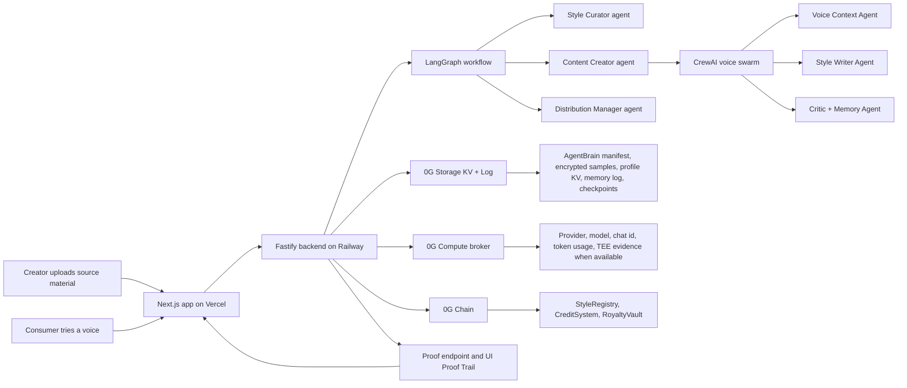

# Voices

Voices turns a creator's writing style into an ownable AI voice agent on 0G.

The project is built for the **0G APAC Hackathon** and is best aligned with **Track 3: Agentic Economy & Autonomous Applications**. Voices combines an AI-driven creator marketplace, Agent-as-a-Service style usage, on-chain credits, and royalty sharing on 0G. A creator uploads or imports writing they own, signs a wallet attestation, Voices extracts a reusable voice profile, stores encrypted AgentBrain evidence on 0G Storage, mints the style into the live registry on 0G Chain, and lets consumers generate new writing through a LangGraph plus CrewAI swarm with proof logs and wallet-confirmed royalty settlement.

The shortest description:

> Voices is a marketplace for creator-owned AI voice agents. Each style is an AgentBrain-backed iNFT-like asset with encrypted memory on 0G Storage, live generation through an agent swarm, and wallet-signable royalties on 0G Chain.

## Hackathon Fit

- Hackathon: [0G APAC Hackathon](https://www.hackquest.io/hackathons/0G-APAC-Hackathon)
- Primary track: **Track 3: Agentic Economy & Autonomous Applications**
- Why this track: Voices is an AI-driven marketplace for creator-owned agents, with credit-based payments, royalty routing, persistent agent memory, and reusable voice agents as a service.
- 0G components used: **0G Storage**, **0G Compute**, and **0G Chain**.

## Live Demo

- App: [voices-bay.vercel.app](https://voices-bay.vercel.app)
- Live style registry: [voices-bay.vercel.app/styles](https://voices-bay.vercel.app/styles)
- Golden demo agent: [voices-bay.vercel.app/styles/10](https://voices-bay.vercel.app/styles/10)
- Try the swarm: [voices-bay.vercel.app/styles/10/try](https://voices-bay.vercel.app/styles/10/try)
- AgentBrain inspector: [voices-bay.vercel.app/dashboard/styles/10/agent-brain](https://voices-bay.vercel.app/dashboard/styles/10/agent-brain)
- Backend health: [voices-bay.vercel.app/api/backend/admin/health](https://voices-bay.vercel.app/api/backend/admin/health)
- Example generation proof: [voices-bay.vercel.app/api/backend/proof/01KQKWKRRRDCKZSC7ZXE9FTQTH](https://voices-bay.vercel.app/api/backend/proof/01KQKWKRRRDCKZSC7ZXE9FTQTH)

The UI also has a top-nav **Proof Trail** link. On the golden style and try pages it jumps directly to the evidence block with the AgentBrain manifest root, profile KV key, memory log stream, latest generation proof, and contract addresses.

## 0G Galileo Deployment

- Network: `0G-Galileo-Testnet`
- Chain ID: `16602`
- RPC: `https://evmrpc-testnet.0g.ai`
- Explorer: `https://chainscan-galileo.0g.ai`
- Faucet: `https://faucet.0g.ai`

| Contract | Address | Explorer |
| --- | --- | --- |
| StyleRegistry | `0x74b904E4097eEE8233a2202e549983F6598Ea5BD` | [open](https://chainscan-galileo.0g.ai/address/0x74b904E4097eEE8233a2202e549983F6598Ea5BD) |
| RoyaltyVault | `0x977254e51EDec8e8840f11F3d30d3a752EED4933` | [open](https://chainscan-galileo.0g.ai/address/0x977254e51EDec8e8840f11F3d30d3a752EED4933) |
| CreditSystem | `0x3e005e11E5420fD7D720F66455B4d303f3Ae4c58` | [open](https://chainscan-galileo.0g.ai/address/0x3e005e11E5420fD7D720F66455B4d303f3Ae4c58) |

The deployment metadata is stored in [`contracts/deployments/0g-galileo.json`](contracts/deployments/0g-galileo.json).

## Why This Exists

Creators already have valuable voice, taste, structure, and recurring judgement in their public work. Today that value usually becomes a private prompt, a brittle fine-tune, or a platform-owned model setting.

Voices makes that voice portable and ownable:

- the creator keeps an on-chain asset representing the voice
- source samples and profile data live encrypted in 0G Storage
- the style can learn over time through a memory log
- generation is performed by agents that read stored evidence instead of loose prompt text
- usage can trigger transparent royalties to the creator

The project is intentionally not a static "style card" marketplace. Each style behaves like a small agent with a persistent AgentBrain, inspectable memory, and a generation swarm behind it.

## What It Does Today

Voices currently supports:

- importing creator source material from TXT/Markdown files, X/Twitter posts, blog/article URLs, and GitHub READMEs
- verifying an EIP-191 wallet attestation before the source material enters the agent workflow
- extracting a structured style profile and detailed style guide through the LangGraph Style Curator workflow
- encrypting samples, profiles, AgentBrain manifests, KV state, log streams, and checkpoints
- listing live registry styles from the deployed `StyleRegistry` contract
- showing the AgentBrain manifest and storage evidence in the app
- generating new content through a CrewAI voice swarm inside the LangGraph flow
- streaming backend agent logs into the chat UI in real time
- preparing wallet-signable credit purchase, mint, and royalty settlement transaction intents
- exposing `/proof/:requestId` pages for judge-readable backend evidence

PDF upload is intentionally not claimed here yet. The current app preserves TXT/Markdown exactly and imports public writing from X, blog/article URLs, and GitHub README sources.

## Golden Demo Proof Trail

For the fastest judge review, use token `10`.

| Field | Value |
| --- | --- |
| Style page | [https://voices-bay.vercel.app/styles/10](https://voices-bay.vercel.app/styles/10) |
| Try page | [https://voices-bay.vercel.app/styles/10/try](https://voices-bay.vercel.app/styles/10/try) |
| Token ID | `10` |
| Creator | `0xE0913679259b2A8F1A904c4950986480172a5749` |
| AgentBrain manifest root | `0x3e3a1d495bba3f802aaca92d5a2c6b3de8393cc09643ef16a14aec48c44617f7` |
| AgentBrain manifest storage tx | `0x0fb4951651ce856105c5083c9368a5b33a968ed6fa0774d5200b1de5c7f72891` |
| Manifest hash | `0x546280313f1d8f3eeb18d1792b70cddebbf46bcdc85bf334dd4147094533d0e9` |
| Profile KV key | `style:pending:01KQF8VGDWFXC4JN1B58DBVYPN:profile` |
| Profile root hash | `0x5fb6dada45312beb567cb07d79cd0366384ed6170028cdcd8ca80a4e1b424274` |
| Profile storage tx | `0x827f09b5adea7550ef0ad4c2d623467ec94ffc1a7fc8327e886afc32b894980a` |
| Samples root hash | `0x9ccffa9b2ce673ada54bf1a583e7f0347868ac4efb604b04abc23c4ae4b15a95` |
| Samples storage tx | `0x71e2a8198d9ca6342254b7393d6ce7f6f2643515f109dd1a701d4d026dbf08e7` |
| Memory log stream | `style:pending:01KQF8VGDWFXC4JN1B58DBVYPN:memory` |
| Key hash | `0x6c3e4dc170e5e072a027c38791f3ff67cad94627c850391c6d7f112b9964a73d` |
| Wrap mode | `ecies-secp256k1-attestation` |
| Style extraction compute model | `qwen/qwen-2.5-7b-instruct` |
| Style extraction compute provider | `0xa48f01287233509FD694a22Bf840225062E67836` |
| Example generation proof | [01KQKWKRRRDCKZSC7ZXE9FTQTH](https://voices-bay.vercel.app/api/backend/proof/01KQKWKRRRDCKZSC7ZXE9FTQTH) |

The current UI now repeats the critical proof fields on both `/styles/10` and `/styles/10/try`, so judges do not need to open devtools or guess which endpoint matters.

## Architecture



### Agent Communication

Voices uses two agent frameworks because they solve different parts of the product.

LangGraph owns the asset lifecycle and durable workflow:

- `Style Curator` verifies attestation, encrypts samples, extracts style profile, builds the AgentBrain, and prepares minting.
- `Content Creator` checks credits, reads the profile, pulls relevant samples, starts generation, and logs the draft.
- `Distribution Manager` emits the final format and prepares spend-credit or settlement transaction intent.

The LangGraph state is persisted through a custom `ZeroGCheckpointSaver`. KV stores the current checkpoint for each thread, while Log stores append-only history for replay and debugging.

CrewAI owns the chat-generation swarm:

- `Voice Context Agent` reads the StyleRegistry evidence, AgentBrain manifest, profile KV, sample excerpts, and memory logs.
- `Style Writer Agent` drafts content from the runtime voice packet.
- `Voice Critic + Memory Agent` checks style fit, critique, and learned preferences for future memory.

CrewAI communicates with Node over JSONL. Each agent emits `agent.activity` records. The frontend subscribes to `/events/stream/:requestId`, so the try page shows live logs from the swarm instead of a single opaque "loading" state.

## 0G Protocol Usage

Voices uses 0G in four places.

### 1. 0G Storage

0G Storage is used for:

- encrypted source samples
- encrypted style profiles
- AgentBrain manifests
- KV-style keys for live profile state
- Log-style streams for memory and generation history
- LangGraph checkpoint state and checkpoint history

The backend also supports a Railway volume-backed cache so the deployed backend can survive redeploys while keeping the same live 0G-facing state and proof history available to the frontend.

### 2. 0G Compute

0G Compute is used for the agentic style/profile path and is wired through the backend compute abstraction. During upload, the Style Curator uses compute to turn creator-owned samples into a structured profile and a prompt-ready style guide. The proof output records provider, model, path, chat id, duration, token usage, and TEE verification fields when returned by the provider.

For the chat phase, the CrewAI runner can use the same compute bridge or a high-quality OpenAI path for demo continuity. The UI and health endpoint report the active mode honestly. In the current live deployment, the backend health endpoint is the source of truth for storage, chain, compute, CrewAI runtime, and persistence modes.

### 3. 0G Chain

0G Chain is used for:

- `StyleRegistry`: live token listing, creator address, royalty, profile URI, encrypted samples URI, metadata hash, and owner-scoped sealed key state
- `CreditSystem`: consumer credits and credit purchases
- `RoyaltyVault`: royalty settlement to creators

The backend creates transaction intents for the user's wallet and verifies receipts before marking mint, credit purchase, or royalty settlement events as confirmed.

### 4. iNFT-Style AgentBrain

Every style is treated as an iNFT-like voice agent:

- the token points to an AgentBrain manifest
- the AgentBrain points to encrypted intelligence and memory
- the owner gets sealed access key metadata
- memory can evolve through 0G Log/KV
- usage can monetize the creator through the royalty flow

This is ERC-7857-inspired in the hackathon build. It demonstrates the ownership, composability, embedded intelligence, and monetization model, while full production transfer proof semantics are documented as a next step.

## Repository Overview

```text
voices/
|-- backend/
|   |-- src/
|   |   |-- agents/          # LangGraph agents, tools, swarm wiring
|   |   |-- http/            # Fastify routes, SSE events, proof endpoints
|   |   |-- infra/           # 0G chain, compute, storage, checkpoint adapters
|   |   `-- smoke-agents.ts  # local proof/smoke workflow
|   `-- crewai_runtime/      # Python CrewAI JSONL runner
|-- contracts/
|   |-- contracts/           # StyleRegistry, CreditSystem, RoyaltyVault
|   |-- scripts/             # deploy, verify, mint scripts
|   `-- deployments/         # 0G Galileo deployment metadata
|-- frontend/
|   |-- app/                 # Next.js App Router pages
|   |-- components/          # reusable UI components
|   |-- context/             # wallet state
|   `-- lib/                 # registry, chain, proof helpers
`-- README.md
```

## Local Setup

Use Node 20+ and pnpm 10.

```bash
corepack enable
corepack prepare pnpm@10.33.2 --activate
pnpm install
cp .env.example .env
```

Fill `.env` with your own keys. Do not commit `.env`.

Minimum local mock mode:

```bash
pnpm backend:mock
pnpm frontend:dev
```

Then open:

```text
http://127.0.0.1:3000/styles
```

Live 0G mode requires a funded Galileo wallet and the 0G/contract environment variables below.

## Environment Variables

Common variables:

```bash
PRIVATE_KEY=
OG_RPC_URL=https://evmrpc-testnet.0g.ai
OG_STORAGE_INDEXER_RPC=https://indexer-storage-testnet-turbo.0g.ai
OG_STORAGE_FLOW_CONTRACT=0x22E03a6A89B950F1c82ec5e74F8eCa321a105296
OG_STORAGE_ENCRYPTION_KEY=
OG_STORAGE_KV_RPC=
STYLE_REGISTRY_ADDRESS=0x74b904E4097eEE8233a2202e549983F6598Ea5BD
ROYALTY_VAULT_ADDRESS=0x977254e51EDec8e8840f11F3d30d3a752EED4933
CREDIT_SYSTEM_ADDRESS=0x3e005e11E5420fD7D720F66455B4d303f3Ae4c58
AGENT_STORAGE_MODE=0g
AGENT_COMPUTE_MODE=0g
AGENT_CHAIN_MODE=0g
AGENT_CHECKPOINT_FLUSH_MODE=0g
CREWAI_RUNTIME_MODE=auto
CREWAI_COMPUTE_MODE=openai
OPENAI_API_KEY=
OG_COMPUTE_PROVIDER_ADDRESS=
OG_COMPUTE_SERVICE_URL=
OG_COMPUTE_MODEL=
OG_COMPUTE_API_KEY=
```

Frontend variables:

```bash
BACKEND_URL=http://127.0.0.1:4317
NEXT_PUBLIC_BACKEND_URL=http://127.0.0.1:4317
FIRECRAWL_API_KEY=
GITHUB_TOKEN=
X_BEARER_TOKEN=
```

Deployment variables differ by host:

- Railway backend should keep the live chain/storage/compute variables and the persistent volume path for backend state.
- Vercel frontend should point `BACKEND_URL` and `NEXT_PUBLIC_BACKEND_URL` at the Railway backend.
- The local seed cache is intentionally ignored by Git and should stay local or on Railway volume only.

## Contracts

Compile and test:

```bash
pnpm --filter contracts compile
pnpm --filter contracts test
```

Deploy to 0G Galileo:

```bash
pnpm --filter contracts deploy:0g
```

Verify contracts:

```bash
pnpm --filter contracts verify:0g <STYLE_REGISTRY_ADDRESS> "https://example.invalid/metadata/"
pnpm --filter contracts verify:0g <ROYALTY_VAULT_ADDRESS> <STYLE_REGISTRY_ADDRESS>
pnpm --filter contracts verify:0g <CREDIT_SYSTEM_ADDRESS> <ROYALTY_VAULT_ADDRESS> <STYLE_REGISTRY_ADDRESS> 1000000000000000
```

Mint a demo token:

```bash
pnpm --filter contracts mint:0g
```

## Backend Commands

Mock local backend:

```bash
pnpm --filter backend start:mock
```

Live 0G backend:

```bash
pnpm --filter backend start:0g
```

Build:

```bash
pnpm --filter backend build
```

Tests and smoke checks:

```bash
pnpm --filter backend typecheck
pnpm --filter backend test
pnpm --filter backend smoke:agents
pnpm --filter backend storage:hello
pnpm --filter backend compute:hello
```

The 0G Compute broker may require enough testnet funds in the compute ledger. Keep extra 0G available for broker ledger setup and gas.

## Frontend Commands

Development:

```bash
pnpm --filter frontend dev
```

Typecheck and build:

```bash
pnpm --filter frontend typecheck
pnpm --filter frontend build
```

## Proof Endpoints

The backend exposes proof and event endpoints for every important workflow.

```bash
GET /proof/:requestId
GET /proof/:requestId          # with Accept: text/html for a browser-readable proof page
GET /events/:requestId
GET /events/stream/:requestId
GET /styles/:tokenId
GET /storage/blob?rootHash=<AGENT_BRAIN_ROOT>
GET /admin/health
```

The proof page includes:

- request status
- agent trail
- AgentBrain fields
- profile and memory keys
- compute call metadata
- checkpoint evidence
- contract addresses
- transaction intents and receipt verification details when available

## Demo Script For Judges

1. Open [the golden style](https://voices-bay.vercel.app/styles/10).
2. Click **Proof Trail** in the nav and verify the manifest root, profile KV key, memory log stream, latest generation proof, and contracts.
3. Open [the try page](https://voices-bay.vercel.app/styles/10/try).
4. Connect a wallet on 0G Galileo.
5. Buy or use one generation credit.
6. Send a prompt such as `write one direct post about autonomous agents owning memory`.
7. Watch the CrewAI agent logs stream in the UI.
8. Open the generated proof page.
9. Sign the royalty settlement transaction to spend one credit and pay the creator.

## Why This Fits HackQuest Track 3

HackQuest's Track 3 focuses on the financial and service layer for the AI era: AI-driven marketplaces, SocialFi agents, Agent-as-a-Service platforms, micropayments, billing, and revenue-sharing. Voices is built directly around that idea.

This is not just a wrapper around a model. The project has:

- a creator-owned AI marketplace where every listed style is a reusable voice agent
- a real multi-agent generation loop with LangGraph lifecycle agents and a CrewAI chat swarm
- long-running agent state through checkpointing
- persistent memory using KV and Log-style storage
- 0G Storage-backed AgentBrain manifests
- live 0G Chain contracts for style ownership, credits, and royalties
- wallet-confirmed credit purchase and spend-credit flows
- proof pages showing how agents communicated and what evidence they used
- an ERC-7857-inspired model for embedded intelligence, ownership, composability, and monetization

The clearest winning angle is the combination of **creator-owned voice agents** plus **visible proof**. Judges can see the agent, use the agent, inspect its memory trail, and follow the royalty path.

## Honest Limitations

- Voices is ERC-7857-inspired, not a complete production ERC-7857 implementation.
- Transfer and clone proof semantics are not fully TEE/ZKP-verified in this hackathon version.
- Some demo paths can use an OpenAI-backed CrewAI fallback if 0G model quality or provider availability blocks the chat phase. The UI and health endpoint should describe the active runtime honestly.
- The key-wrapping model is suitable for a hackathon proof of concept. Production should require stronger wallet public-key attestation or oracle-assisted re-wrapping.
- The deployed backend depends on live RPC/storage/compute availability and Railway volume persistence.

## Submission Checklist

- Project name: `Voices`
- Hackathon: `0G APAC Hackathon`
- Primary track: `Track 3: Agentic Economy & Autonomous Applications`
- Short description: creator-owned AI voice agents with AgentBrain memory, 0G proof trails, wallet-confirmed credits, and royalty settlement
- Contract addresses: listed above
- Public GitHub repo: [github.com/yashwanth-3000/voices](https://github.com/yashwanth-3000/voices)
- Live demo: [voices-bay.vercel.app](https://voices-bay.vercel.app)
- Demo video: add final under-3-minute video link before submission
- Protocol features used: 0G Storage, 0G Compute, 0G Chain, ERC-7857-inspired encrypted AgentBrain metadata
- Swarm explanation: LangGraph lifecycle agents plus CrewAI voice-generation agents, documented above
- iNFT proof: `/styles/10`, `/styles/10/try`, and `/dashboard/styles/10/agent-brain` expose the embedded intelligence and memory evidence
- Team/contact: add final Telegram and X handles before submission
